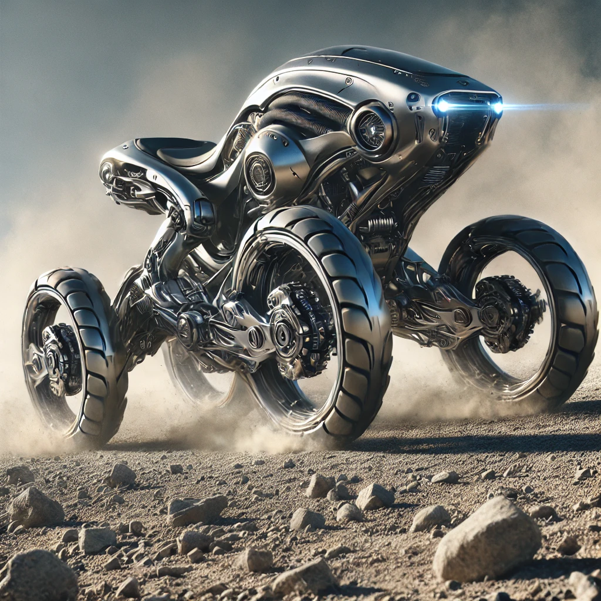

In the beginning, we rode with the wind—on the backs of horses, swift and noble. We climbed with goats, whose hooves knew no hesitation. We crossed wilderness with the pack mule, patient and enduring. These beasts were not just tools; they were companions. They lent us their strength, their instincts, their wild grace. And we, in turn, carried their spirit with us.

As the world turned, we forged their forms into steel. We captured the horse in the engine, the mule in the truck, the goat in the all-terrain frame. Cars, motorcycles, and ATVs became our modern beasts. But in doing so, we traded muscle for mechanism, instinct for inertia. Their motion—once agile, alert, alive—became constrained. They rode only where roads allowed. They moved in straight lines, rigid and lifeless, unable to follow us into the wild places their ancestors once roamed freely.

Now, a new kind of beast is born—not to replace the old, but to honor it.

Forged not from coldness, but from reverence, this creature of motion carries within it the legacy of every hoofbeat, every climb, every burden borne in quiet loyalty. It moves with the power of a galloping horse, the balance of a mountain goat, and the resolve of the mule. But it does so as a partner—one shaped by human hands to echo the soul of animals past.

This is the next step—not a machine, but a living rhythm, powered by our memory of the wild. Its limbs are built to feel the land, its frame sculpted for grace, not dominance. We do not merely sit atop it—we ride with it, into forests, across tundras, over cliffs and dunes, as once we did with the creatures we loved and learned from.

This is not the end of the animal bond.
It is its transformation.

A new beast walks beside us—born not of nature alone, nor of machine alone, but of both. Through it, we carry the wisdom of the old world into the unknown paths ahead.

This is not the future of transportation.
This is the rebirth of the journey.

